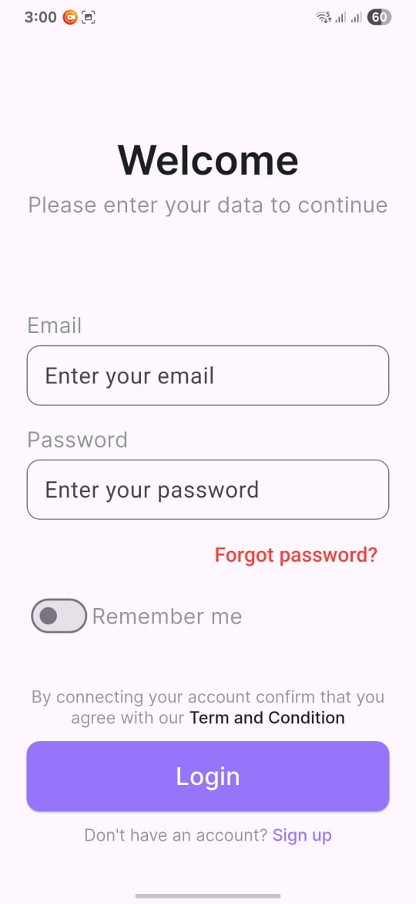
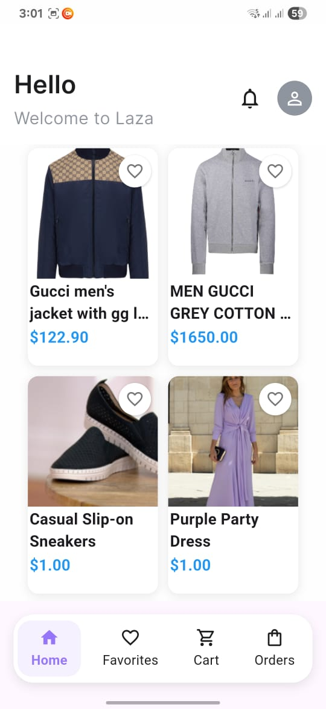
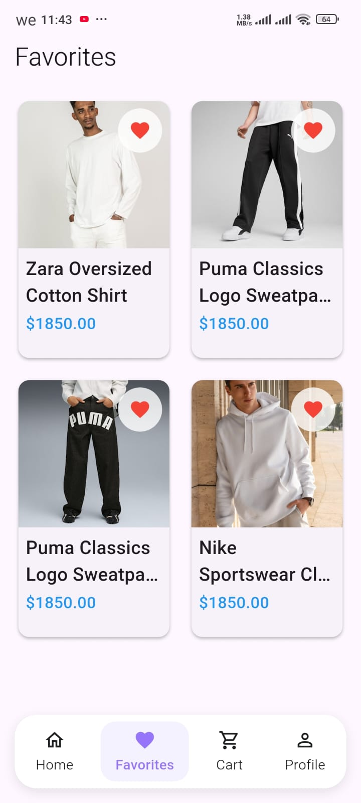
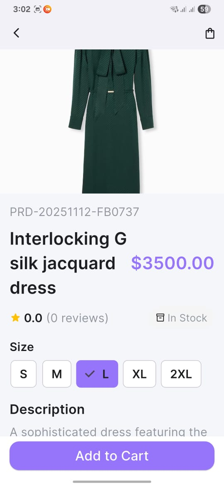
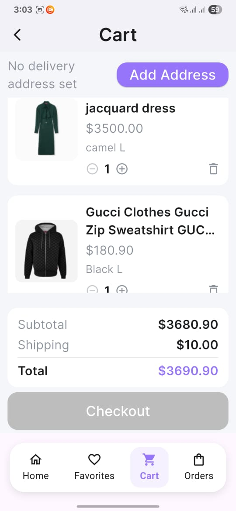
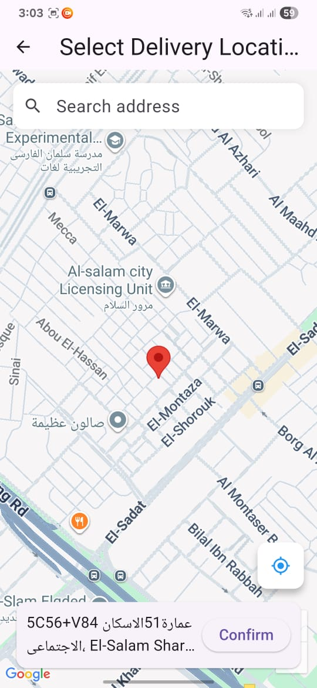
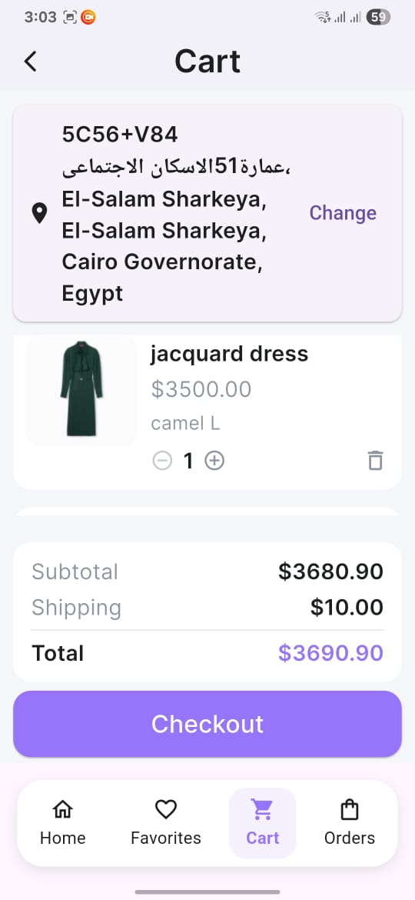
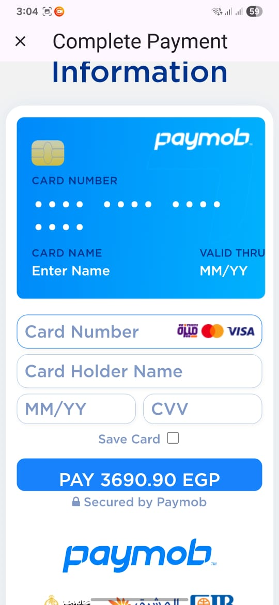
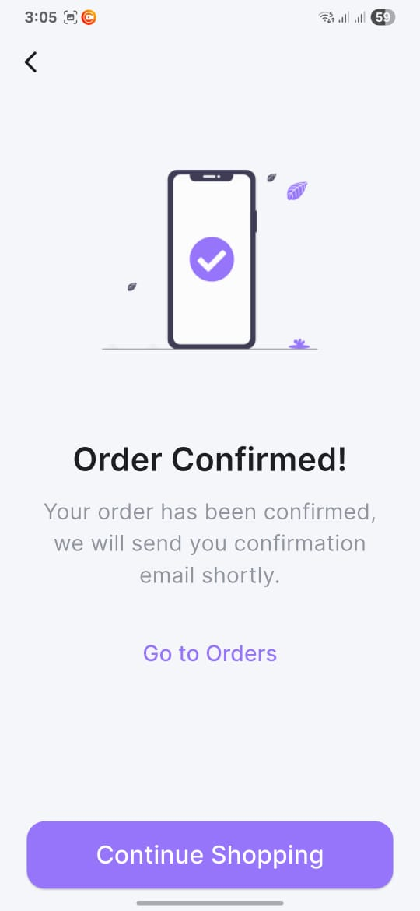
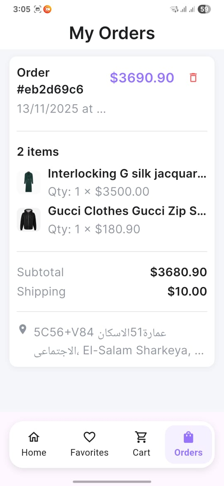

# Laza E-commerce App
[](https://deepwiki.com/Badr-Elarby/Badr-Elarby-Week-3-Ecommerce-App-Laza-)

Laza is a stylish and modern e-commerce mobile application built with Flutter.  
It provides a seamless shopping experience for users to browse, favorite, and purchase products —  
with maps integration, payment flow, and full order management.
* * * * * * * * * * * * * * * * * * * * * * * * * * * * * * * * * * * * * * * * * * * * * * * * * * * * * * * * * * * * * * * 
For a deeper understanding of the project — including detailed diagrams and an in-depth breakdown of each layer and feature —  
**[click here](https://deepwiki.com/Badr-Elarby/Badr-Elarby-Week-3-Ecommerce-App-Laza-/2.1-clean-architecture-and-layered-design)**.
* * * * * * * * * * * * * * * * * * * * * * * * * * * * * * * * * * * * * * * * * * * * * * * * * * * * * * * * * * * * * * * 


## 🚀 Key Features

- **User Authentication**  
  Login & signup using email/password with secure token handling (access + refresh tokens).

- **Onboarding Flow**  
  Tailored experience with gender selection.

- **Product Discovery**  
  - Home screen with curated products  
  - Brand filters (Nike / Adidas / Puma / Fila)  
  - Search functionality  

- **Product Details**  
  Multiple images, description, price, rating, and stock info.

- **Favorites (Wishlist)**  
  Save products locally with persistent storage.

- **Shopping Cart**  
  Add/remove items, update quantities, and view order summary.

- **Address Selection (Maps)**  
  Choose delivery address from a live map using Google Maps.

- **Payment Flow**  
  Full checkout experience including entering card details and placing an order.

- **Orders Screen**  
  A complete history of user's orders.

- **Order Confirmation**  
  Visual confirmation after placing an order successfully.

- **Declarative Routing**  
  Built with `go_router` + shell navigation for main tabs.

---
## 🧱 Architecture & Tech Stack

This project follows a clean, feature-first architecture to ensure scalability and maintainability.

- **Clean Architecture** (Feature-based)
- **State Management:** Cubit / flutter_bloc  
- **DI:** get_it  
- **Networking:** dio + interceptors  
- **Local Storage:**  
  - flutter_secure_storage – tokens  
  - shared_preferences – cart, favorites, gender  
- **Routing:** go_router  
- **Maps:** google_maps_flutter  
- **Payment UI:** custom credit card form  
- **Animations:** shimmer & flutter_animate  
- **UI Scaling:** flutter_screenutil  

## Getting Started

To get a local copy up and running, follow these simple steps.

### Prerequisites

- Flutter SDK (version 3.8.1 or higher)
- A compatible IDE (like VS Code or Android Studio)
- An emulator or physical device to run the app

### Installation & Setup

1.  **Clone the repository:**
    ```sh
    git clone https://github.com/badr-elarby/badr-elarby-week-3-ecommerce-app-laza-.git
    ```
2.  **Navigate to the project directory:**
    ```sh
    cd badr-elarby-badr-elarby-week-3-ecommerce-app-laza-
    ```
3.  **Install dependencies:**
    ```sh
    flutter pub get
    ```
4.  **Run the application:**
    ```sh
    flutter run
    ```

## Project Structure

The project's `lib` directory is organized to separate concerns and features, making it easy to navigate and extend.

```
lib/
├── core/
│   ├── di/
│   ├── network/
│   ├── routing/
│   ├── services/
│   ├── utils/
│   └── widgets/
└── features/
    ├── auth/
    ├── cart/
    ├── favorites/
    ├── home/
    ├── onboarding/
    ├── product_details/
    ├── orders/
    ├── payment/
    ├── map/
    └── splash/

```


## 📸 Screenshots

---

### 🔐 Authentication
| Login |
|:--:|
|  |

---

### 🟢 Splash & Onboarding
| Onboarding |
|:--:|
|  |

---

### 🏠 Home Screens
| Home 1 | Home 2 |
|:--:|:--:|
|  |  |

---

### 💖 Favorites
| Favorites |
|:--:|
|  |

---

### 📄 Product Details
| Product Details |
|:--:|
|  |

---

### 🛒 Cart (Before Address)
| Cart (Before Adding Address) |
|:--:|
|  |

---

### 📍 Address Selection (Google Maps)
| Select Address on Map |
|:--:|
|  |

---

### 🛒 Cart (After Address)
| Cart (Address Added) |
|:--:|
|  |

---

### 💳 Payment
| Enter Card Details |
|:--:|
|  |

---

### ✅ Order Confirmation
| Order Confirmation |
|:--:|
|  |

---

### 📦 Orders Page
| My Orders |
|:--:|
|  |

---

## 🎬 Demo Video


